# Tree

A tree organises values (data) hierarchically. Each entry in the tree is called a node and every node links to zero or more child nodes.

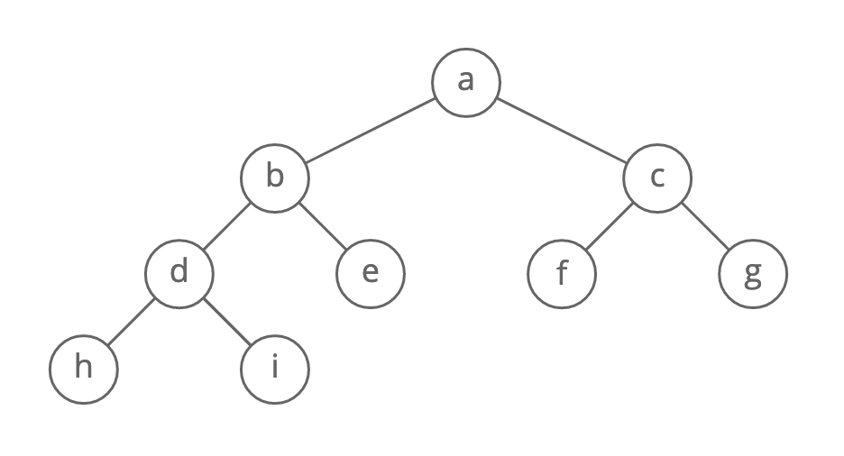

Use Cases:
1. File systems - files inside folders insider folders.
2. Comments - comments and replies to comments and replies to replies.

### Leaves, Depth and Height
**Leaf nodes** are nodes that are at the bottom of the tree (nodes that have no children).

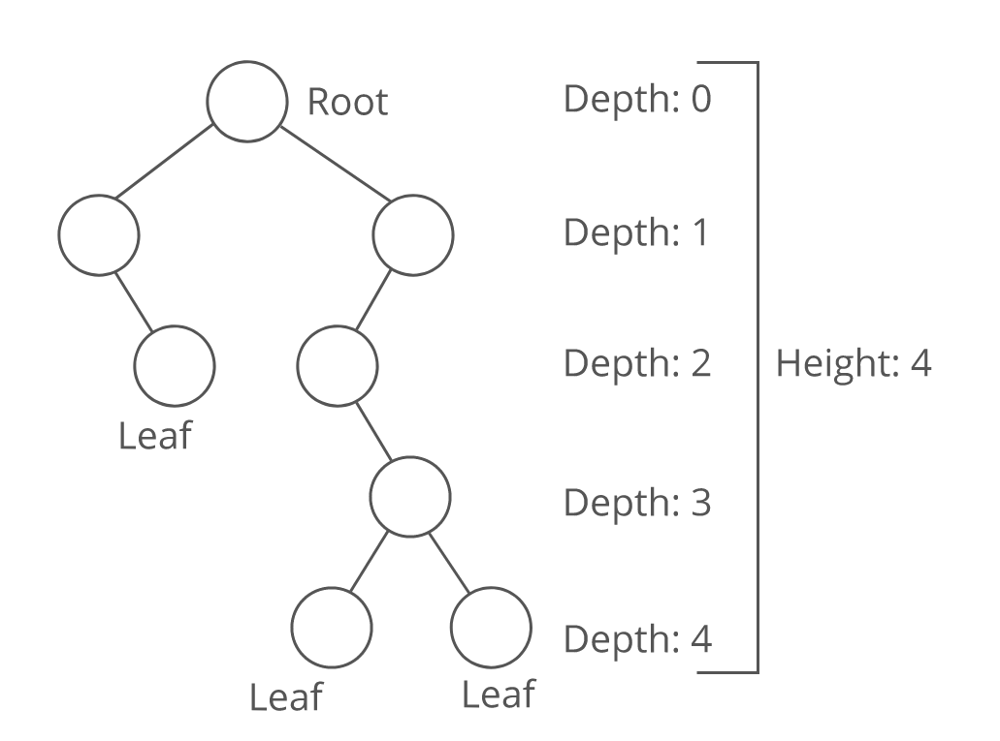

Each node in a tree has a **depth**, which is the number of links from the root to the node, starting from root as 0.

A tree's height is the number of links from its root to the furthest leaf (or maximum node depth).

### Tree Traversals
#### Breadth First Search (BFS)
In BFS, we first explore all the nodes one step away, then all the nodes two steps away, etc.

#### Depth First Search (DFS)
For DFS, we go as deep as possible down one path before backing up and trying a different one.

#### Comparing BFS and DFS
1. A BFS will find the shortest path between the starting point and any other reachable node. A depth-first search will not necessarily find the shortest path.
2. Depth-first search on a binary tree generally requires less memory than breadth-first.
3. Depth-first search can be easily implemented with recursion.

We can also use BFS and DFS on graphs.

#### Pre Order Traversal
Visit the current node, then walk the left subtree, and finally walk the right subtree.

A pre-order traversal usually visits nodes in the same order as a DFS. 

#### In Order Traversal
Walk the left subtree first, then visit the current node, and finally walk the right subtree. 

Of all three traversal methods, this one is probably the most common. When walking a binary search tree, an in order traversal visits the nodes in sorted, ascending order. 

#### Post Order Traversal
Walk the left subtree, then the right subtree, and finally visit the current node. 

The pre, in and post refers to the position of the root (current) node.

# Binary Tree
A **binary tree** is a tree where every node has at most two children.

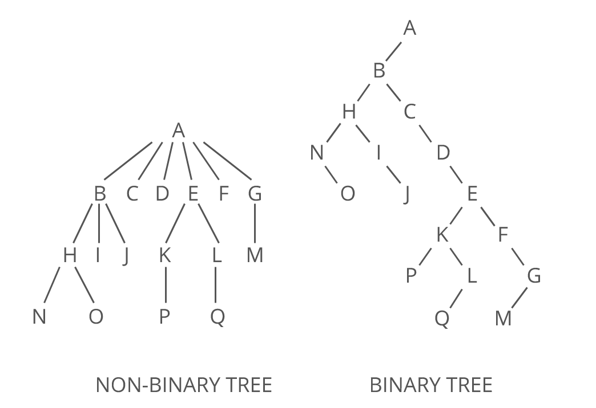

### Full Binary Trees
A **full binary tree** is a binary tree where every node has exactly 0 or 2 children.

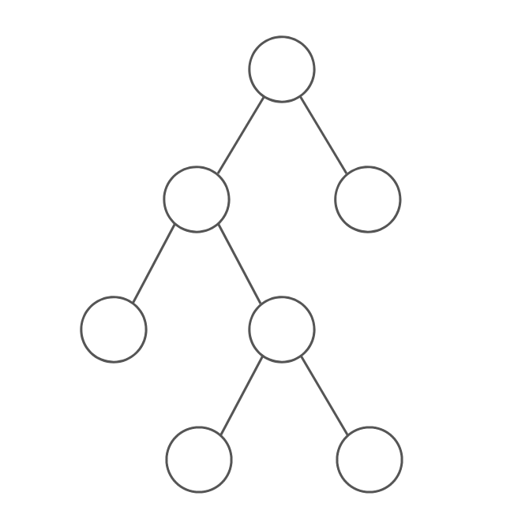

### Perfect Binary Trees
A **perfect binary tree** doesn't have room for any more nodes (unless we increase the tree's height).

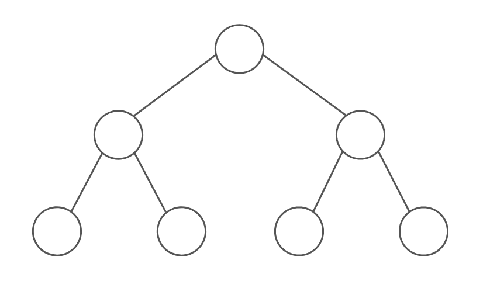

### Complete Binary Trees
A **complete binary tree** is like a perfect binary tree missing a few nodes in the last level, nodes are filled from left to right.

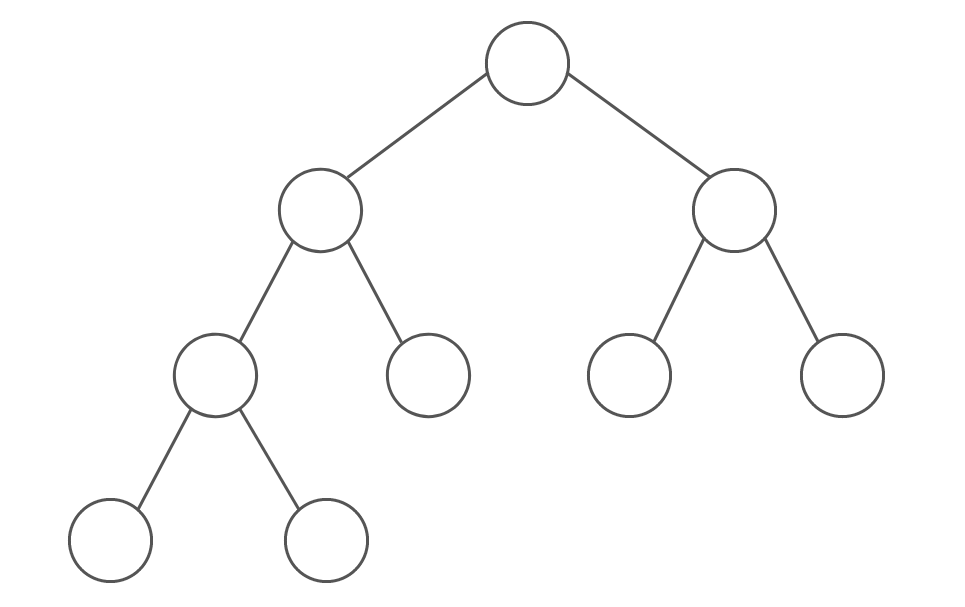

Complete trees are the basis for heaps and priority queues. 

### Balanced Binary Trees
A **balanced binary tree** is a tree whose height is small relative to the number of nodes is has. By small, we usually mean the height is O(log(N)), where N is the number of nodes.

Conceptually, a balanced tree "looks full," without any missing chunks or branches that end much earlier than other branches. 

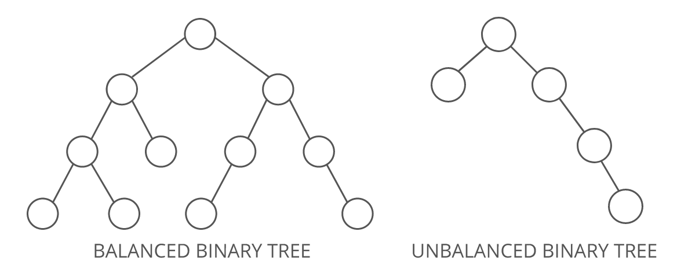

There are few different definitions of balanced depending on the context. One of the most common definition is that a tree is balanced if: 
- (a) the heights of its left and right subtrees differ by at most 1, and 
- (b) both subtrees are also balanced. 

### Relationship between height and number of nodes
Suppose we have n nodes in a tree, the relationship between the number of total nodes and the height of the tree for a perfect binary tree is as follows:
log2(n+1) = h

A perfect tree is balanced, and in a perfect tree the height grows logarithmically with the number of nodes. 

# Binary Search Tree 
A **binary search tree** is a binary tree where the nodes are ordered in a specific way, it could be an empty tree or for every node:
- The nodes (sub-tree) to the left are smaller than the current node.
- The nodes (sub-tree) to the right are larger than the current node.

Recursively, their left and right sub-trees are also binary search trees.

Time Complexity:
|   Operations    |   Balanced    |  Unbalanced (Worst Case)  |
| :-------------: |:-------------:| :------------------------:|
|    Insertion    |   O(log(N))   |            O(N)           |
|    Look Up      |   O(log(N))   |            O(N)           |
|    Deletion     |   O(log(N))   |            O(N)           |

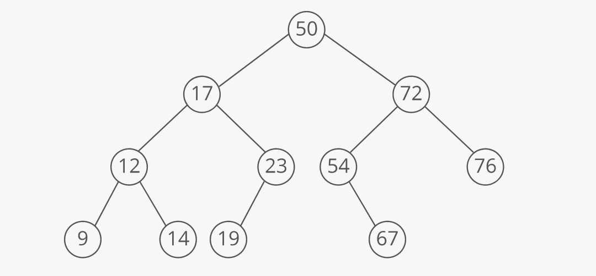

Advantages:
1. Good performance - assuming binary search trees are balanced, they are good at a lot of operations:
- Comparing to a sorted array, lookups take the same amount of time O(log(N)), but insertions and deletions are faster O(log(N)) while arrays take O(N).
- Comparing to hash tables (dictionaries in Python), binary search trees have better worst case performance O(log(N)) instead of O(N). But on average hash tables (O(1) time complexity) perform better than binary search trees.
2. Binary search trees are sorted - taking all the elements in a binary tree and pull out all of them as sorted can be done in O(N) using in-order traversal. Finding a element closest to a value can be done in O(log(N)) time complexity.

Disadvantages:
1. Poor performance is unbalanced - if a binary search tree is not balanced, then operations will become O(N).
2. No O(1) operations, on average an array or a hash table will be faster.

### Balanced Binary Search Trees
Some trees (such as AVL trees or red-black trees) rearrange nodes as they are inserted to ensure the tree is always balanced. With these, the worst case complexity for searching, inserting or deleting is always O(log(N)), not O(N).

# Trie
A **trie** is a special tree that can compactly store strings. It's also called prefix tree or digital tree.

Here's a example trie that stores "David", "Maria", and "Mario":

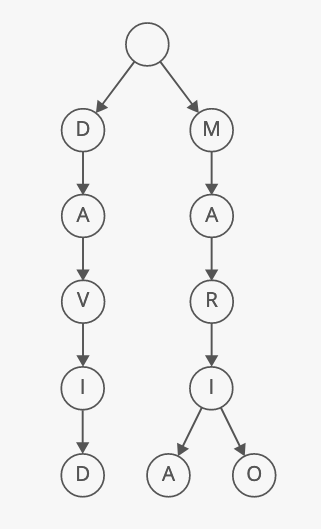

Advantages:
1. Sometimes Space Efficient - if we are storing a lot of words that start with similar patterns then tries may reduce the overall storage space required.
2. Efficient Prefix Queries - tries can quickly answer queries about words with shared prefixes, such as how many words start with "choco"?

Disadvantages:
1. Usually Space Inefficient - ASCII characters in a string are only one byte each while each link between trie nodes is a pointer and usually 8 bytes (on 64 bit system).
2. Not Standard, most programming languages don't come with built-in trie implementation.

### Marking word endings
What happens if we have two words and one is a prefix of the other?

For instance, say we had a trie with "Maria" and "Mariana". That's confusing ... it looks like we only have one word ("Mariana") even though we inserted two. 

To avoid this, most tries append a special character to every word as a "flag" for the end of the word. Let's use "." as our "end of word" marker. Here's what our trie looks like now: 

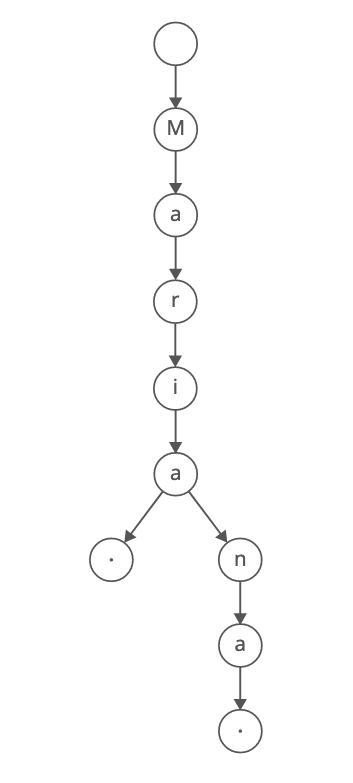

### Tries v.s. Sets
Say we are implementing a spell checker. You'll look for each word to see if it appears in Merriam-Webster's dictionary. 

We could put all the dictionary words in a trie. Or, you could put them in a set. 

Both of them have the same average-case look-up complexity, O(K) where K is the number of characters in the look up string.
- For the trie, you'd have to walk from the root of the trie through K nodes, one character at a time.
- For the set, you have to compute a hash value from all K characters of the string in order to index into the underlying array.

So which one shall we use?

If we want to quickly find words starting with the same prefix, for example, a spell checker, then trie is better.

If we want to check if a string is present or we are optimising for space, then set is better.

### Radix Trees
A **radix tree** is like a trie, but it saves space by combining node together if they only have one child. 

Here is an example of a radix tree with "Maria", "Mariana", and "David":

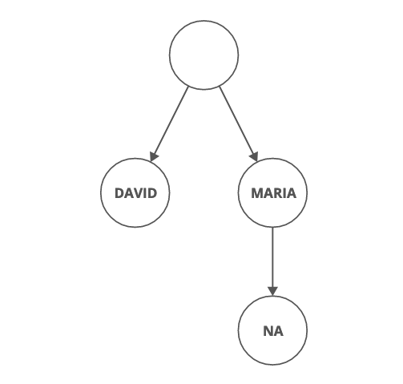

It has way fewer nodes and links than the trie version we looked at above. 

Radix trees are more cache friendly than tries, since the characters within a single node are usually stored in an array of characters, adjacent to each other in memory.

# Heap
A **binary heap** is a binary tree where the smallest or largest value is always at the top. A min-heap has the smallest value at the top. A max-heap has the largest value at the top.

Operations:
- Get Min - O(1)
- Remove Min - O(log(N))
- Insert - O(log(N))
- Heapify - O(N) - heapify is the process of converting a binary tree into a heap.

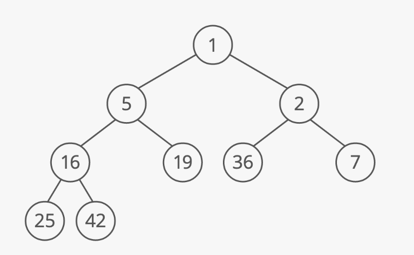

Advantages:
1. Quicky access the smallest or the largest item in O(1) time.
2. Space efficient - binary heaps are usually implemented using lists, so saving the cost of storing pointers to child nodes.

Disadvantage:
1. Limited interface - finding other items (apart from the smallest or largest item) will take O(N) time.

Use Cases:
1. Priority Queues - priority queues are usually implemented using heaps with the highest-priority item can be quickly grabbed from the top.
2. Effciently sort a list of items - put all elements in a heap and remove the top once a time.

## Implementation
Heaps are implemented as **complete binary trees**.
In a complete binary tree:
- each level is filled up before another level is added;
- the bottom tier is filled from left to right.
This allows us to efficiently store our heap as an array (list).

In a heap, every node is smaller (min heap) or larger (max heap) than its children.

#### Inserting a new item 
1. Add the item to the bottom of the tree. 
2. Compare the item with its parent. If the new item is smaller, swap the two. 
3. Continue comparing and swapping, allowing the new item to "bubble up" until the it's larger than its parent. 

Because our heap is built on a complete binary tree, we know it's also balanced. Which means the height of the tree is log(n). So we'll do at most lg⁡n\lg{n}lgn of these swaps, giving us a total time cost of O(log(⁡n)). 

#### Removing the smallest item 
It's easy to remove the item at the top.
Now, we have to shuffle some things around to make this a valid heap again. 
1. Take the bottom level's right-most item and move it to the top, to fill in the hole.
2. Compare the item with its children. If it's larger than either child, swap the item with the smaller of the two children. 
3. Continue comparing and swapping, allowing the item to "bubble down" until it's smaller than its children. 
We'll do at most log(⁡n) of these swaps, giving us a total time cost of O(log(⁡n)). 

### Heaps are built on lists 
Complete trees and heaps are often stored as lists, one node after the other, like this:

Using a list to store a complete binary tree is very efficient. Since there are no gaps in complete trees, there are no unused slots in the list. And, inserting a new item in the bottom right part of the tree just means appending to the list. 

### Reference
1. [Data Structures Reference - Tree](https://www.interviewcake.com/concept/python/tree)
2. [Data Structures Reference - Binary Search Tree](https://www.interviewcake.com/concept/python/binary-search-tree)
3. [Data Structures Reference - Trie](https://www.interviewcake.com/concept/python/trie)
4. [Data Structures Reference - Heap](https://www.interviewcake.com/concept/python/heap)
