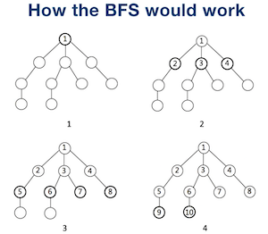

# Breadth First Search (BFS)

## How BFS Works
We can use queue to store current node's child nodes.


BFS 算法的常用场景：

在一幅「图」中找到从起点 start 到终点 target 的最近距离。


## BFS Example Code
Template for BFS:
``` Python
def bfs(graph, start, end):
    # Queue to store nodes, we can also use deque. 
    queue = []
    queue.append(start)
    # For graph where nodes could connect to each other.
    visited = set()
    visited.add(start)

    while queue:
        node = queue.pop()
        # Add the current node to visited set.
        visited.add(node)

        process(node)
        # Generate child nodes for the current node.
        nodes = generate_related_nodes(node)
        queue.push(nodes)

    # other processing work
```

## Reference
1. [BFS 算法框架套路详解](https://labuladong.github.io/algo/%E7%AE%97%E6%B3%95%E6%80%9D%E7%BB%B4%E7%B3%BB%E5%88%97/BFS%E6%A1%86%E6%9E%B6.html)