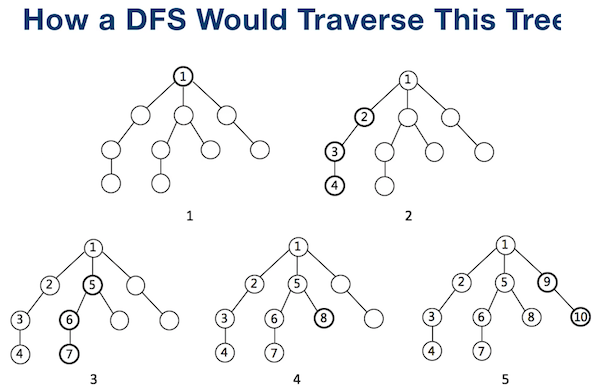
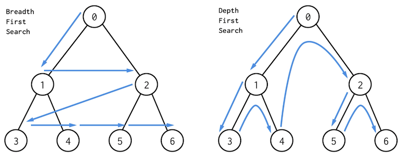

# Depth First Search

## How DFS Works
We can use stack to store traversed nodes.



Comparison between BFS and DFS:



## DFS Example Code
Recursion:

``` Python
visited = set()

def dfs(node, visited):
    # Add the current node into visited set.
    visited.add(node)

    # Process current node.

    # Add all the child nodes of current node into stack.
    for next_node in node.children():
        if not next_node in visited:
            dfs(next_node, visited)
```
Recursion itself used stack. 
It's recommended to use recursion to implement DFS.

Non-recursion:
``` Python
def dfs(tree):
    if tree.root is None:
        return [] 

    visited, stack = [], [tree.root]

    while stack:
        node = stack.pop()
        visited.add(node)

        process(node)
        nodes = generate_related_nodes(node)
        stack.push(nodes)

    # Other processing work
```
