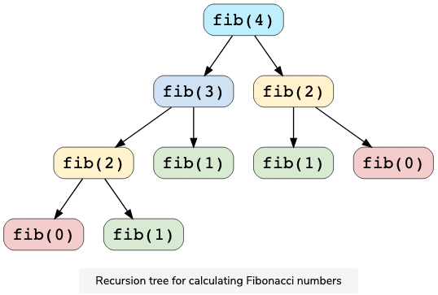

# Dynamic Programming (DP)
## DP Introduction
**Dynamic Programming (DP)** is an algorithmic technique for **solving an optimization problem by breaking it down into simpler subproblems** and **utilizing the fact that the optimal solution to the overall problem depends upon the optimal solution to its subproblems**.

We can understand the word "programming" here as "recurrence" , so `Dynamic Programming == Dynamic Recurrence`.

Dynamic Programming Methods：
1. Top-down with memorization (Recursion + Memorization)
2. Bottom-up with tabulation.

Two keypoints about DP (whether the problem is suitable for DP):
1. Optimal substructure - means that the solution to a given optimization problem can be obtained by the combination of optimal solutions to its sub-problems.
2. Overlapping sub-problems - means that the space of sub-problems must be small, that is, any recursive algorithm solving the problem should solve the same sub-problems over and over, rather than generating new sub-problems.

## DP Problem Solving Process

1. Define states - 
2. Recurrence formulation (state transition equation) - 
3. Initialization - 


## Fibonacci Numbers
Fibonacci numbers are a series of numbers in which each number is the sum of the two preceding numbers.
The equation is as follows:

```
Fib(n) = Fib(n-1) + Fib(n-2), for n > 1
```
### Overlapping Subproblems
Subproblems are smaller versions of the original problem. Any problem has overlapping sub-problems if finding its solution involves solving the same subproblem multiple times.

For the Fibonacci numbers, such as finding f(4), we need to break down to the following sub-problems:


We can see that there are overlapping sub-problems such as fib(2), which is evaluated twice.

### Optimal Substructure Property
Any problem has optimal substructure property if its overall optimal solution can be constructed from the optimal solutions of its subproblems.

For Fibonacci numbers:
```
Fib(n) = Fib(n-1) + Fib(n-2)
```

## Reference
1. [Grokking Dynamic Programming Patterns for Coding Interview](https://www.educative.io/courses/grokking-dynamic-programming-patterns-for-coding-interviews/m2G1pAq0OO0)