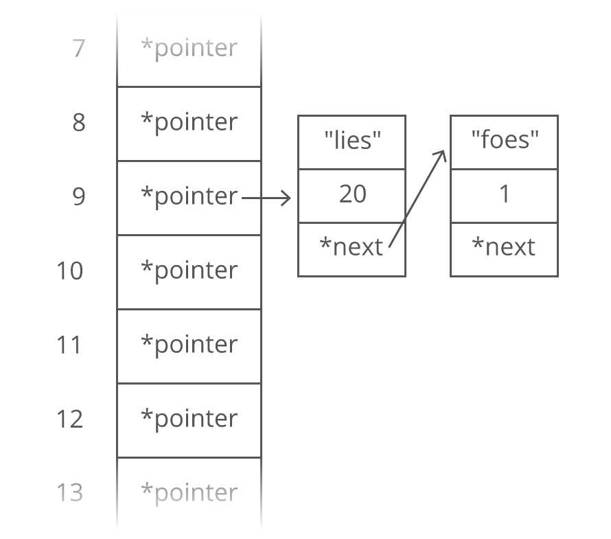

# Hash Table

A **hash table** organises data so you can quickly look up values for a given key.

Hash table is also called **hash map**, **unordered map** or **dictionary** in Python.

## Operations
Insert - Average O(1) Worst Case O(N)
Look up - Average O(1) Worst Case O(N)
Delete - Average O(1) Worst Case O(N)

## Advantages
1. Fast lookups - lookups take O(1) time on average.
2. Flexible keys - most data types can be used as keys as long as they are hashable.

## Disadvantages
1. Unordered - keys unordered, looking up for smallest key will take O(N).
2. Not Cache-friendly - as many hash table implementations using linked lists, so
the data is not next to each other in memory (not continuous).

## How does hash maps work?
Hash maps are built on arrays, as we all know, arrays are quite similar to hash maps in the sense that arrays let you quickly look up the value for a given index, while it's for keys in hash maps.

If we can use a function to convert a key into an array index, then we can use the array index to access data. The function is called **hashing function**.

To look up the value for a given key, we can run the key through hashing function to get the index to go into in our underlying array to grab the value.

## How does hashing functions work?
A simple example is using mod. Suppose we get a string as a key, "lies"， where we can add up the ASCII value for each character, and then get the sum (429 here). Then if we only have 30 slots, we can take the mod (modulus operator %) of the sum by 30 to ensure we get a value less than 30. For example, 429 % 30 = 9.

The hashing functions used in modern systems are much more complicated, it's just a simplified exmaple here.

## Hash collisions
What if two keys have the same 'hashed' value? They will then pointing to he same array index. For example, "lies" and "foes" will share the same hash value if we take the ASCII sum and mod by 30 (both 9). This is called **hash collision**.

One way to solve the problem is using linked lists, instead of having actual values in the array, we can hold a pointer to a linked list where all values for the key is stored. We shall include the keys and values for each node in the linked list, otherwise we wouldn't know which key is for which value.

## Worst case
1. Hash collisions - when all our keys caused hash collisions, we will need to walk through all of our values for a single lookup (for all the nodes in the linked list).

2. Dynamic array resizing - suppose we keep adding items into the hash map and the number of items has exceeded the number of the original underlyign array, then hash collision wil be inevitable. So we need to expand the underlying array, and it will take O(N) time complexity.

## Sets
A set is like a hash map except it only stores keys without values.

Sets are very useful especially when we are tracking groups of items, such as nodes we've visited in a graph, characters we've seen in a string. We've ofen interested in whether something is in a set or not.

Sets are usually implemented very similarly to hash maps, using hashing to index into an array.

## How are dictionaries implemented in CPython?
CPython’s dictionaries are implemented as **resizable hash tables**. Compared to B-trees, this gives better performance for lookup (the most common operation by far) under most circumstances, and the implementation is simpler.

Dictionaries work by computing a hash code for each key stored in the dictionary using the hash() built-in function. The hash code varies widely depending on the key and a per-process seed; for example, “Python” could hash to -539294296 while “python”, a string that differs by a single bit, could hash to 1142331976. The hash code is then used to calculate a location in an internal array where the value will be stored. Assuming that you’re storing keys that all have different hash values, this means that dictionaries take constant time – O(1), in Big-O notation – to retrieve a key.

# Bloom Filter
A bloom filter is a space-efficient data structure that lets you quickly check whether an item is in a set or not.

The tradeoff for that space efficiency is that it's probabilistic: sometimes instead of giving you concrete answers it just says "probably".

When you look up an item in a bloom filter, the possible answers are:
- It's definitely not in the set. This is a true negative.
- It might be in the set. This could be a false positive, or it could be a true positive.

Operations:
Insert - O(1)
Lookup - O(1)

Advantages:
1. Space Efficient - bloom filters take O(1) space, regardless of the number of items inserted.
2. Fast - insertion and lookup both take only O(1) time.

Disadvantages:
1. Probabilistic - bloom filters can only definitively identify true negatives, they can not identify true positives. If a bloom filter says an item is present, that item might actually be present (a true positive) or it might not (a false positive).
2. Limited Interface - bloom filters only support the insert and lookup operations. You can't iterate through the items in the set or delete items. 

## Implementation
Under the hood, a bloom filter is just a bitmap. Initially, all the bits are set to 0. 

It's fixed size as bloom filters require O(1) space. 

## Insertion
To insert an element:
1. Hash the item (such as string);
2. Mod the result by the length of our bitmap;
3. Set that bit to 1.

## Lookup
To check if a word is in our bloom filter:
1. Hash the item;
2. Mod the result by the length of our bitmap;
3. Check if the corresponding bit is 0 or 1.

If the bit is 0, then that word **definitely isn't** in our set. If it were, we would have set that bit to 1.

But if the bit is 1, then that word might be in our set. But it could be a false positive.

This false positive isn't a bug; it's a tradeoff we've made to keep checks fast. 

Bloom filters are only appropriate when it's feasible to handle false positives. 

## Use Cases
Bloom filter can be used as a first layer of filtering. We can use it in anywhere where knowing if something is definitely not present or possibly present would be helpful. 

One common use is to eliminate unnecessary accesses to slower storage / expensive lookups.

## Handling False Positive

### Bitmap Size
As the number of items inserted into a bloom filter increases, so does the likelihood of a false positive. That's because over time, we'll end up setting most of the bits to 1, instead of 0.

The larger the bitmap, the less likely false positives are. When using a bloom filter, it's helpful to know ahead of time roughly how many elements will be in your set. That way you can make the bitmap large enough to avoid a high false positive rate. 

### Multiple Hash Functions
Another way to avoid a high false positive rate is to use multiple hash functions.

In the examples above we only used one hash function, checking one bit in the bitmap for each lookup.

When using multiple hash functions:
- To add a new item: generate a bitmap index with each hash function, and set all of those bits to 1.
- To check if an item is present: just check if any of the bits checked are still 0. If so, the item is definitely not present.

## Reference
1. [Data Structures Reference - Hash Table](https://www.interviewcake.com/concept/python/hash-map)
2. [How are dictionaries implemented in CPython?](https://docs.python.org/3.7/faq/design.html#how-are-dictionaries-implemented-in-cpython)
1. [Data Structures Reference - Bloom Filter](https://www.interviewcake.com/concept/python3/bloom-filter?)