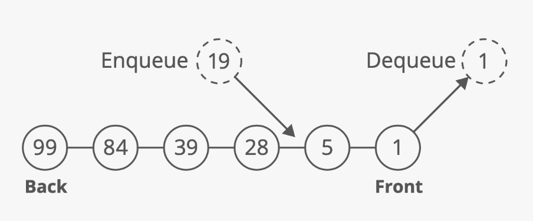

# Stack and Queue

## Stack
A stack stores items in a **last-in, first-out (LIFO)** order. 
Operations:
- push() - O(1)
- pop()  - O(1)
- peek() - O(1)

All stack operations take O(1) time complexity.
The space complexity for stack is O(N).

You can implement a stack with a linked list or a dynamic array.

Applications:
1. The call stack for functions.
2. Depth First Search (DFS)
3. Web Broswer - move forward and backward.

## Queue
A queue stores items in a **first-in, first-out (FIFO)** order. 
Operations:
- enqueue() - O(1)
- dequeue() - O(1)
- peek()    - O(1)

All queue operations take O(1) time complexity. 
The space complexity for queue is O(N).

You can implement a stack with a linked list:
- To enqueue, insert at the tail of the linked list.
- To dequeue, remove at the head of the linked list.

Applications:
1. Breadth First Search (BFS)
2. Printers - using queues to manage printing jobs.
3. Web Servers - using queues to manage requests.

## Priority Queue
A priority queue is a special queue where:
1. Every item in the queue has a priority and 
2. Higher-priority items are dequeued before lower-priority items.

Advantage:
- Quickly access the highest-priority item - Priority queues allow you to peek at the top item in O(1) while keeping other operations relatively cheap O(log(n)).  

Disadvantage:
- Slow enqueues and dequeues - since we need to re-prioritise the queue, and it will take O(log(n)) time.

Use Cases:
1. Operating system schedulers - use priority queues to select the next process to run.
2. Some algorithms rely on priority queues:
- Dijkstra's shortest path
- A* Search
- Huffman code (encoding for data compression)

### Implementation
#### Binary Heaps
Priority queues are often implemented using **binary heaps**. Highest priority is at the top of the heap, ready to be grabbed in O(1) time.
- To enqueue an item, add it to the heap using the priority as the key - O(log(N)).
- To peek at the highest priority item, just look at the item at the top - O(1).
- To dequeue the highest priority item, remove the top item from the heap - O(log(N)).

#### Other Implementations
1. A sorted list (array), which highest priority at index zero.
2. A sorted linked list, dequeue takes only O(1).

## Problem List:
- [x] [Valid Parentheses](https://leetcode-cn.com/problems/valid-parentheses/)
- [x] [Implement Stack Using Queues](https://leetcode-cn.com/problems/implement-stack-using-queues/)
- [x] [Implement Queue Using Stacks](https://leetcode-cn.com/problems/implement-queue-using-stacks/)
- [x] [Min Stack](https://leetcode-cn.com/problems/min-stack/)
- [x] [Evaluate Reverse Polish Notation](https://leetcode-cn.com/problems/evaluate-reverse-polish-notation/)
- [x] [Design Circular Deque](https://leetcode-cn.com/problems/design-circular-deque/)
- [x] [Longest Valid Parentheses](https://leetcode-cn.com/problems/longest-valid-parentheses/)
- [x] [Sliding Window Maximum](https://leetcode-cn.com/problems/sliding-window-maximum/)
- [x] [Kth Largest Element in a Stream](https://leetcode-cn.com/problems/kth-largest-element-in-a-stream/)
