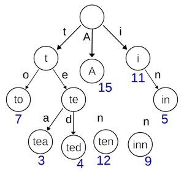

# Trie
**Trie**, also called **digital tree** or **prefix tree**, is a tree data structure could be used for counting and sorting a huge amount of strings. The main idea is to use the common prefixes to reduce the search time complexity.

The root node doesn't contain any characters. 
The path (edge) from one node to another represent a character.

Example:


Use cases:
1. Search engine promot
2. Autocomplete
3. Spellchecker

Properties:
1. The root node doesn't contain any characters, apart from root node, each contain one or none charcters.
2. From the root node to a specific node, the characters concatenated will be the string it can represent.
3. For each node, the children are not the same characters.

Source code:
``` Python
ALPHABET_SIZE = 26

class TrieNode:
    def __init__(self, alphabet_size=ALPHABET_SIZE):
        self.children = [None] * alphabet_size
        # Represent the end of a word
        self.is_end_of_word = False
```