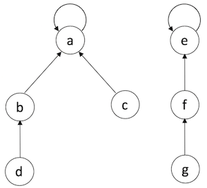
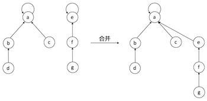
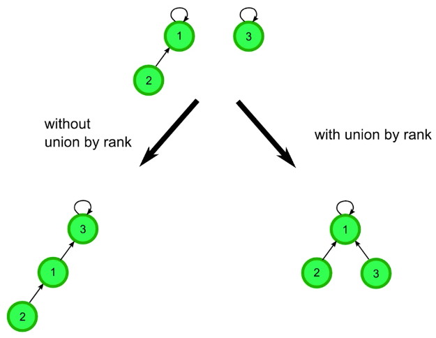
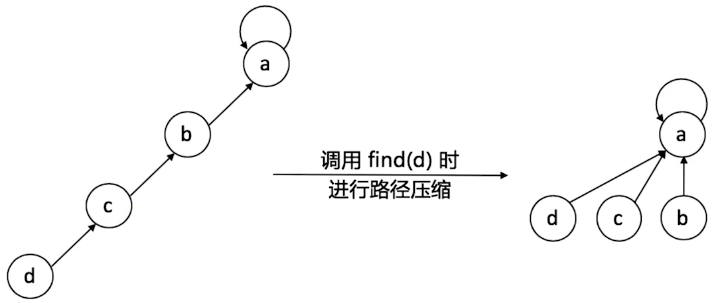

# Union Find

**Union Find** is a tree data structure, which could be used to handle **disjoint sets**' merging and searching problems.

并查集算法主要是解决图论中「动态连通性」问题，如判断图中有多少个连通分量[(connected component)](https://en.wikipedia.org/wiki/Component_(graph_theory))。

「连通」是一种等价关系，也就是说具有如下三个性质：

1. 自反性：节点 p 和 p 是连通的。
2. 对称性：如果节点 p 和 q 连通，那么 q 和 p 也连通。
3. 传递性：如果节点 p 和 q 连通，q 和 r 连通，那么 p 和 r 也连通。

这种「等价关系」非常实用，比如说编译器判断同一个变量的不同引用，比如社交网络中的朋友圈计算等等。



Union Find's two operations:

**Find**: Check which subset the element belongs to (finding the root node), which could be further used to check whether two elements belongs to the same subset (connected).

**Union**: Mege two subsets into one set. 如果某两个节点被连通，则让其中的（任意）一个节点的根节点接到另一个节点的根节点上

**Connected**: Check whether two nodes are connected.

## Two Optimization Methods
To merge two Union Find trees (subsets), we need to find the root node of each tree (subset), and then merge them into one.



### Optimization - Union by Rank
**Rank (秩)** - the depth of Union Find tree. 
Merge the tree with a smaller rank to the higher one, so we can reduce the merged Union Find tree's rank.



### Optimisation - Path Compression
Compress the path to make each node connects to its root node directly.



## Implementation
Union Find could be implemented by array.

### Initialization
When initializing the array, each element's value equals to it's index (meaning it is its own root, pointing to itself).

树的每个节点都有一个指针指向其父节点，如果该节点是根节点的话，这个指针指向自己。


### Pseudocode
```
function MakeSet(x)
    x.parent := x

function Find(x)
    # Find the root node. 
    if x.parent = x
        return x
    else
        return Find(x.parent)

function Union(x, y)
    xRoot := Find(x)
    yRoot := Find(y)
    xRoot.parent := yRoot
```

### Python Code Example
``` Python
class UnionFind:
    def __init__(self, length: int):
        self.roots = [i for i in range(length)]
        self.rank = [0] * length
        self.count = length
    
    def find_root(self, node):
        """ Find the root node for the given node. """
        root = node
        # Find root node.
        while root != self.roots[root]:
            root = roots[root]
        
        # Path compression.
        while node != self.roots[node]:
            roots[node], node = root, roots[node]
        
        return root

    def connected(self, node1, node2):
        """ Check if two nodes are connected (have common root). """
        return self.find_root(node1) == self.find_root(node2)

    def union(self, node1, node2):
        """ Merge two sets into one. """
        node1_root = self.find_root(node1)
        node2_root = self.find_root(node2)
        # self.roots[node2_root] = node1_root
        
        # Union by rank
        if node1_root != node2_root:
            if self.rank[node1_root] > self.rank[node2_root]:
                self.parent[node2_root] = node1_root
            elif self.rank[node1_root] < self.rank[node2_root]:
                self.parent[node1_root] = node2_root
            else:
                self.parent[node2_root] = node1_root
                self.rank[node1_root] += 1
```
